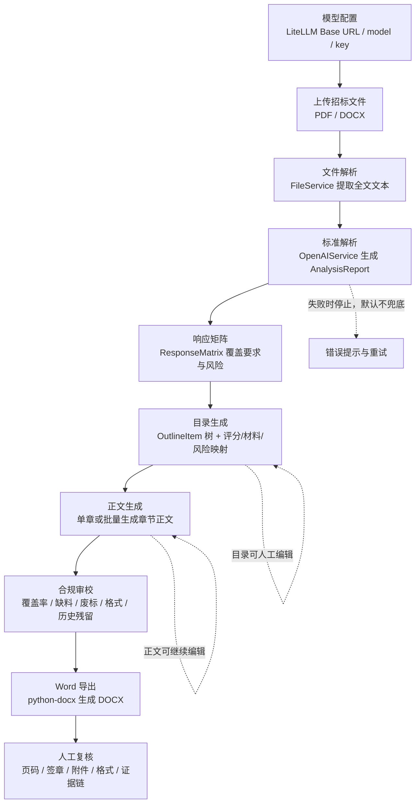
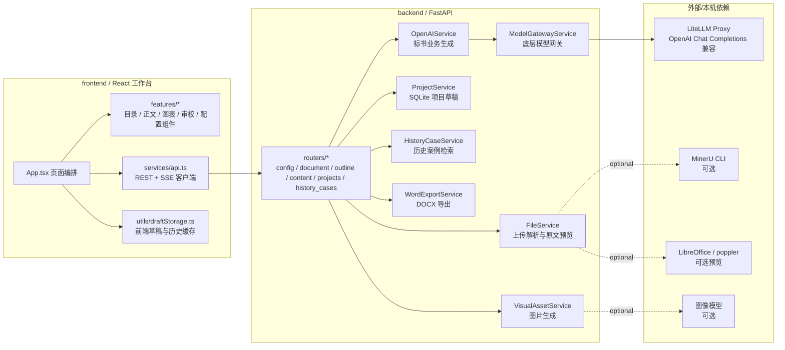
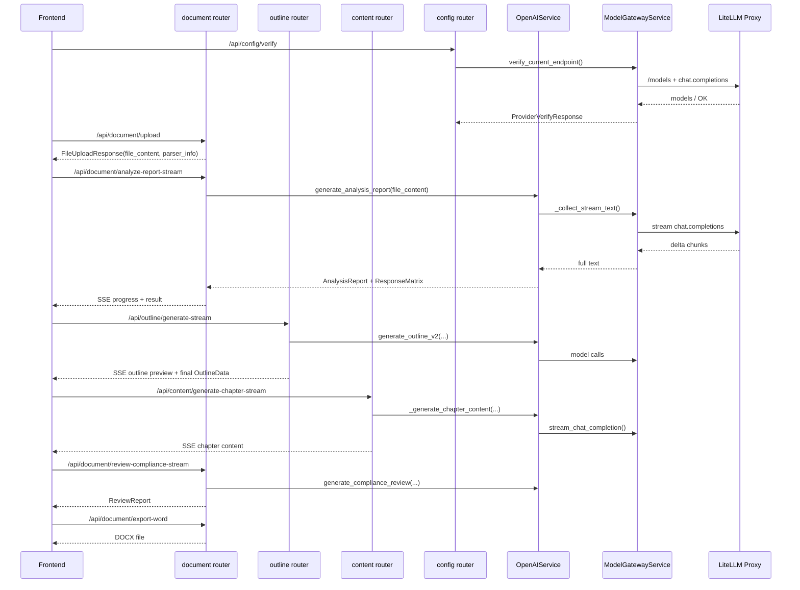
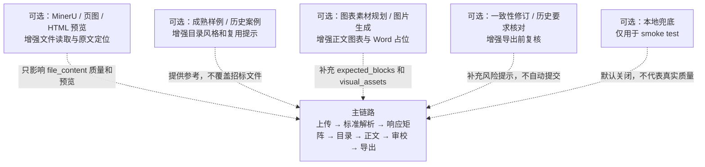

# 项目架构与功能边界

本文档说明 `yibiao-simple` 的主流程、后端/前端分层，以及 optional 功能的边界。核心原则是：招标文件原文和结构化解析结果驱动主链路；历史案例、成熟样例、图表素材、原文预览、MinerU 等能力只做增强，不应替代主事实源。

## 主流程

主流程用于完成一次可导出的投标文件草稿。除模型配置外，其余步骤都应围绕同一份招标文件和同一个项目草稿推进。



主链路数据结构：

- `AnalysisReport`：标准解析报告，是目录、正文、审校的主要事实源。
- `ResponseMatrix`：把评分项、资格项、形式项、响应性条款、废标风险、材料要求映射成可覆盖清单。
- `OutlineItem`：投标文件目录树，承接章节标题、评分映射、材料映射、风险等级、正文内容和图表占位。
- `ReviewReport` / `ConsistencyRevisionReport`：导出前风险和一致性检查结果。
- `ProjectResponse` / 项目库草稿：保存当前草稿、章节正文、历史记录和前端恢复状态。

## 分层架构



后端职责边界：

- `ModelGatewayService` 只负责底层模型调用：配置读取、Base URL 候选、OpenAI SDK client、模型列表、端点验证、流式请求、runtime monitor、`response_format` JSON guard。
- `OpenAIService` 只负责业务生成：prompt 组织、JSON/Pydantic 校验、标准解析、响应矩阵、目录、正文、审校、样例风格、图表规划和生成策略。
- `FileService` 只负责文件输入和原文可读性增强，不负责标书业务判断。
- `WordExportService` 负责把当前草稿导出为 DOCX，不负责继续调用模型补内容。
- `HistoryCaseService` 提供历史案例召回和核对证据，不应覆盖招标文件中的硬约束。

## API 主链路



## Optional 功能边界

| 功能 | 入口 | 默认状态 | 依赖 | 产物 | 失败/关闭时主流程行为 |
| --- | --- | --- | --- | --- | --- |
| MinerU 版面解析 | `FileService.parse_file` | 关闭，`YIBIAO_DOCUMENT_PARSER=legacy` | 本机 `mineru` CLI / PyTorch | Markdown、content list、图片链接 | 使用内置 `pdfplumber` / `docx2python` / `PyPDF2` 解析，不阻塞上传 |
| 原文页图预览 | `FileService` 预览方法 | 关闭，`YIBIAO_ENABLE_SOURCE_PREVIEW_PAGES=0` | LibreOffice / poppler | 页面图片、文本块 bbox | 前端使用纯文本分页预览 |
| DOCX HTML 预览 | `FileService` DOCX 预览 | 开启，`YIBIAO_ENABLE_DOCX_HTML_PREVIEW=1` | `python-docx` | `sourcePreviewHtml` | 失败时前端使用纯文本分页预览 |
| 提取图片上传 | `FileService` 图片处理 | 关闭，`YIBIAO_UPLOAD_EXTRACTED_IMAGES=0` | 本地文件/静态资源目录 | 解析图片资源 URL | 不影响正文生成，只少一些图片参考 |
| 成熟样例模板 | `/api/document/reference-style-upload` 或历史匹配 | 手动触发 | 真实模型 + 样例文件/历史库 | `ReferenceBidStyleProfile` | 目录和正文按招标文件与默认规则生成 |
| 历史案例匹配 | `/api/history-cases/match-reference` | 手动触发 | `history_cases.sqlite3` + 模型选择 | 匹配案例、样例风格 | 用户可手动上传样例或跳过 |
| 历史要求核对 | `/api/history-cases/check-requirements` | 手动触发 | 历史案例库 | 要求满足/未命中证据 | 只影响提示和核对，不改变解析事实源 |
| 图表素材规划 | `/api/document/document-blocks-plan-stream` | 手动触发，`YIBIAO_AUTO_DOCUMENT_BLOCKS_PLAN=0` | 模型 | 表格/图片/流程图/承诺书规划 | 正文和导出继续，图表占位减少 |
| 图片生成 | `/api/document/generate-visual-asset` | 手动触发 | 图像模型 | base64 或图片 URL | Word 中保留占位，人工替换 |
| 全文一致性修订 | `/api/document/consistency-revision-stream` | 手动触发 | 模型 | `ConsistencyRevisionReport` | 合规审校和导出仍可执行 |
| 搜索路由 | `ENABLE_SEARCH_ROUTER=true` | 关闭 | `backend/app/optional/search.py` + `backend/requirements-optional.txt` | 搜索结果 | 不影响标书主链路 |
| 旧扩写接口 | `ENABLE_LEGACY_EXPAND_ROUTER=true` | 关闭 | `backend/app/optional/expand.py` | 旧目录参考 | 保留兼容，不参与默认流程 |
| MCP DuckDuckGo | 手动运行 | 关闭 | `backend/optional/mcp/` + optional 依赖 | MCP 搜索工具 | 与 FastAPI 主流程隔离 |
| 构建/发布/运行数据 | 构建脚本或运行时生成 | 非源码 | `artifacts/build/`、`artifacts/release/`、`artifacts/data/`、`artifacts/tmp/` | 静态包、发布包、SQLite、生成素材 | 默认 `.gitignore`，可用 env 指向外部路径 |
| 本地兜底生成 | `YIBIAO_ENABLE_GENERATION_FALLBACKS=1` + `YIBIAO_FORCE_LOCAL_FALLBACK=1` | 关闭 | 无模型或 smoke test | 兜底报告/目录/正文/审校 | 默认关闭；真实生成失败应报错并重试 |

## 功能边界图



## 事实源优先级

所有生成阶段应按以下优先级处理冲突：

1. 招标文件原文、澄清/答疑/补遗。
2. `AnalysisReport` 中从原文提取的结构化要求。
3. 企业已提供资料、材料清单、人工编辑过的目录和正文。
4. 历史案例库、成熟样例模板、企业知识库。
5. 通用行业经验和模型常识。

历史案例、成熟样例和图表素材不能覆盖招标文件确定的投标范围、评分标准、资格要求、固定格式、签章要求、报价规则和废标条款。

## 性能开关

当前默认偏向“先跑通主链路、减少上传阶段和目录阶段额外耗时”：

```bash
YIBIAO_DOCUMENT_PARSER=legacy
YIBIAO_MINERU_TIMEOUT=900
YIBIAO_ENABLE_SOURCE_PREVIEW_PAGES=0
YIBIAO_ENABLE_DOCX_HTML_PREVIEW=1
YIBIAO_UPLOAD_EXTRACTED_IMAGES=0
YIBIAO_MODEL_CONCURRENCY=2
YIBIAO_OUTLINE_CONCURRENCY=2
REACT_APP_YIBIAO_CONTENT_CONCURRENCY=2
YIBIAO_ENABLE_GENERATION_CACHE=1
YIBIAO_AUTO_DOCUMENT_BLOCKS_PLAN=0
YIBIAO_ENABLE_GENERATION_FALLBACKS=0
```

建议只在明确需要时打开 optional 功能。例如需要版面级 Markdown 再启用 MinerU，需要图表占位再手动执行图表素材规划，需要样例风格再上传成熟样例或匹配历史案例。

## 维护建议

- 新增业务生成能力时优先放在 `OpenAIService`，不要把 prompt、schema 校验或标书业务判断放进 `ModelGatewayService`。
- 新增模型协议或网关兼容逻辑时优先放在 `ModelGatewayService`，不要让路由直接调用 OpenAI SDK。
- 新增可选增强功能时，应保证关闭或失败时主链路仍可继续，除非该功能被用户明确选为当前任务的硬前置。
- 前端组件继续向 `features/*` 下拆分，`App.tsx` 保持页面状态编排和流程连接，不继续堆大型展示组件。
- 文档、环境变量和 UI 文案需要同步说明 optional 功能默认状态，避免用户误以为慢速增强链路是必选步骤。

## 并发与缓存约束

前端任务状态以 `tasks: Record<TaskId, TaskState>` 表示，保留 `busy` 作为旧页面按钮和顶部忙碌条的兼容字段。任务依赖按 DAG 表达：`upload_text` → `analysis` → `outline` → `batch` → `review/consistency` → `export`；`history_match` 可在上传后独立运行，`source_preview` 可在上传后异步增强。

上传链路已拆成 `POST /api/document/upload-text` 和 `GET /api/document/source-preview/{source_preview_id}`。前者只抽取可供分析、历史匹配、目录生成使用的文本，后者单独生成 DOCX 原文预览并回填前端状态；因此 Word 预览渲染失败或变慢不会阻塞标准解析和历史案例匹配。旧 `POST /api/document/upload` 保留兼容，仍会同步返回文本和预览。

后端所有模型流式调用通过 `ModelGatewayService` 的统一 semaphore 限流，默认 `YIBIAO_MODEL_CONCURRENCY=2`。目录内部二三级生成继续使用 `YIBIAO_OUTLINE_CONCURRENCY`，正文批量生成由前端 `REACT_APP_YIBIAO_CONTENT_CONCURRENCY` 控制，但最终仍会被后端模型限流兜住。

重任务缓存由 `GenerationCacheService` 管理，默认写入 `artifacts/data/generation_cache/`。缓存 key 包含任务名、模型名、`YIBIAO_PROMPT_VERSION` 和输入 payload，当前覆盖标准解析、目录生成、成熟样例剖面和历史案例匹配。修改 prompt、schema 或模型时应更新 `YIBIAO_PROMPT_VERSION` 或关闭缓存重新生成。

正文并发生成完成后必须执行一致性收口，重点检查历史残留、重复内容、承诺冲突和虚构风险；并发只用于提速正文初稿，不替代最终审校。
